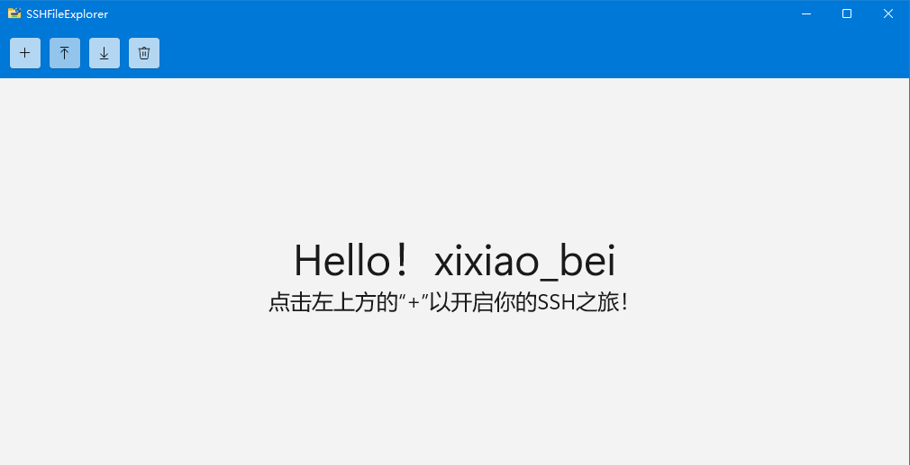
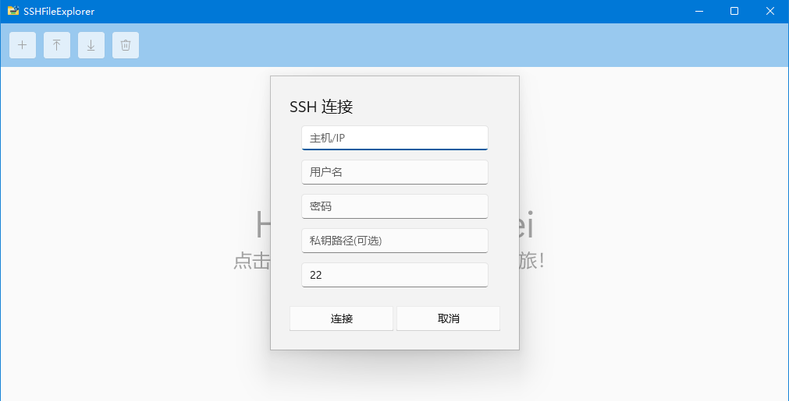
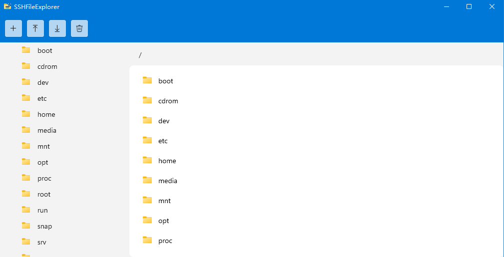
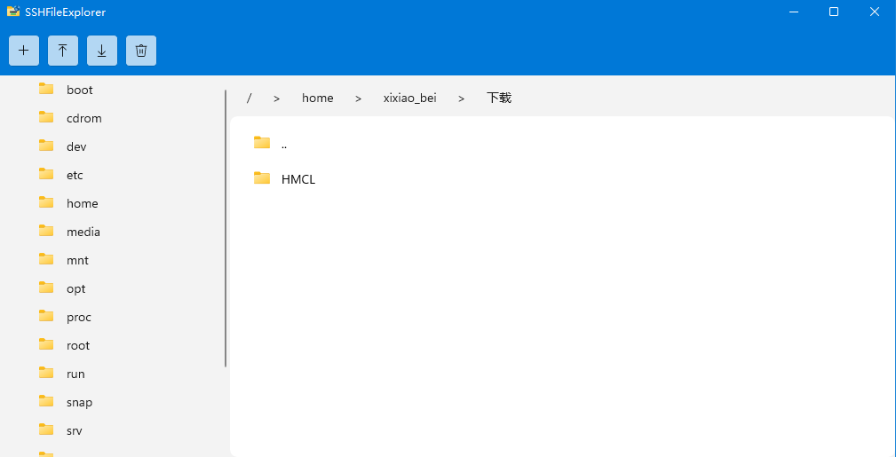

<div align="center">
  
</div>

# SSHFileExplorer

一个实用的SSH文件管理工具

## 软件功能

1.浏览文件

2.下载/上传/删除文件

3.私钥连接

## 软件特性

1.面包屑导航

2.自适应图标

3.独立文件夹列表

## 软件截图






## 构建

```sh
git clone https://github.com/xixiaobei-bei/SSHFileExplorer.git

cd SSHFileExplorer

msbuild SSHFileExplorer.csproj /p:Configuration=Release /p:Platform=x64
```

## 许可证

本软件使用GNU GPLv3 许可证

- **你可以**：  
  - 自由使用、复制、分发本软件  
  - 修改源代码并分发修改后的版本  
  - 将本软件用于商业或私人目的  

- **你必须**：  
  - **保留原始版权声明和许可证文本**（包括代码文件头和本 README 中的声明）  
  - **公开任何分发或修改版本的完整源代码**（同样使用 GPLv3 许可证）  
  - **明确标示出你所做的修改**  
  - **在软件界面的“关于”对话框中显示原作者信息**（至少包含项目名称和原始版权声明）

- **你不可以**：  
  - **删除或隐藏任何版权、作者或许可证信息**  
  - **将本软件或其修改版本作为闭源软件分发**  
  - **以自己的名义重新发布本软件而不注明原始来源**

详情请参阅 [GNU GPLv3 许可证](https://www.gnu.org/licenses/gpl-3.0.html)

同时，本软件同样包含其他项目并遵循其许可证要求：

- [WinUI 3](https://github.com/microsoft/microsoft-ui-xaml) – MIT 许可证  
- [Fluent UI System Icons](https://github.com/microsoft/fluentui-system-icons) – MIT 许可证  